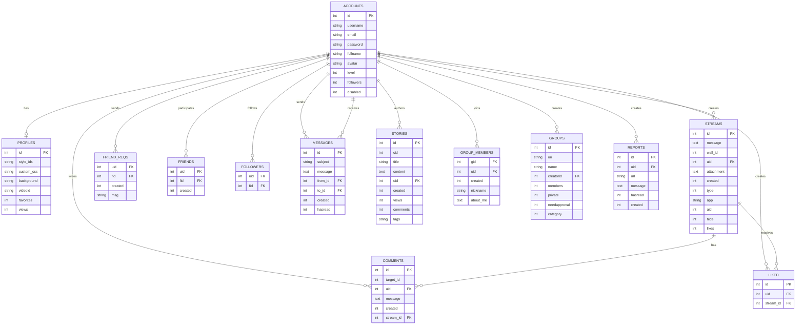
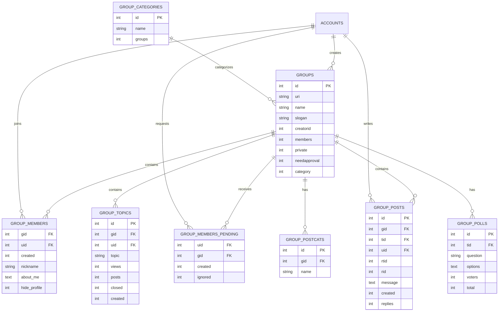
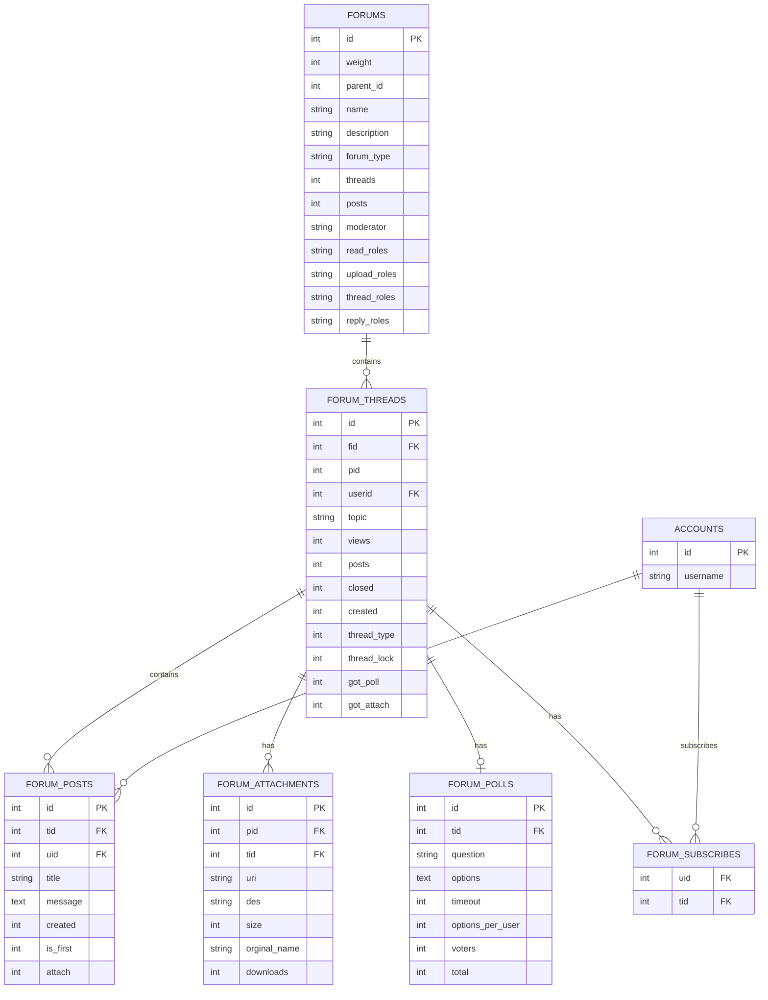
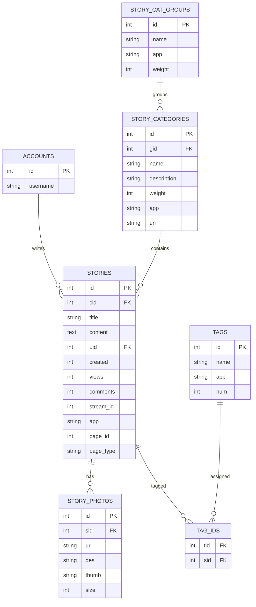

Bisa. Saya sudah analisis langsung file **`jcow_backup(3).sql`** yang kamu kirim. Ini bukan sekadar membaca nama tabel—saya cek struktur `CREATE TABLE`, index, sample data `INSERT`, dan relasi yang bisa diinfer dari kolom/key.

**Catatan penting:** database JCow ini **tidak memiliki foreign key sama sekali** dan seluruh **51 tabel menggunakan MyISAM**. Jadi ERD di bawah adalah **logical ERD**: relasi saya infer dari pola `uid`, `fid`, `gid`, `sid`, `tid`, dll. Saya tidak akan mengklaim relasi tersebut sebagai FK resmi karena memang tidak ada di dump.

---

# 1. Executive Summary Database JCow

Dari file SQL:

```text
Database: jcow
MySQL: 5.7.44
Jumlah tabel: 51
Storage Engine: MyISAM
Foreign Key: 0
```

Database JCow sebenarnya bukan hanya social network sederhana.

Strukturnya menunjukkan setidaknya **9 domain besar**:

```text
JCow
│
├── Identity & User
├── Social Graph
├── Social Feed / Stream
├── Content / Stories
├── Messaging & Notification
├── Groups
├── Forum
├── Pages
└── System / Configuration
```

Jadi untuk proyek migrasi kalian, **jangan treat 51 tabel ini sebagai 51 fitur yang harus dibuat satu per satu**.

Lebih tepat:

```text
51 Legacy Tables
       ↓
Domain Analysis
       ↓
Business Capability
       ↓
Laravel Modules
       ↓
Target Database
```

---

# 2. Daftar Seluruh 51 Tabel

Saya kelompokkan berdasarkan fungsi.

## A. Identity & User

| Table              | Fungsi                       |
| ------------------ | ---------------------------- |
| `jcow_accounts`    | User/account utama           |
| `jcow_profiles`    | Profile customization        |
| `jcow_roles`       | Role user                    |
| `jcow_banned`      | User/IP ban                  |
| `jcow_invites`     | Invitation                   |
| `jcow_user_crafts` | User temporary/security data |
| `jcow_blacks`      | Blacklist user               |

---

# 3. Social Graph

| Table              | Fungsi             |
| ------------------ | ------------------ |
| `jcow_friends`     | Relasi pertemanan  |
| `jcow_friend_reqs` | Friend request     |
| `jcow_followers`   | Follow/follower    |
| `jcow_favorites`   | Favorite item/user |
| `jcow_liked`       | Like stream        |
| `jcow_votes`       | Rating/voting      |

---

# 4. Social Feed / Activity

| Table                   | Fungsi                 |
| ----------------------- | ---------------------- |
| `jcow_streams`          | Activity/status stream |
| `jcow_comments`         | Comment                |
| `jcow_profile_comments` | Profile/wall comment   |
| `jcow_messages`         | Notification/inbox     |
| `jcow_messages_sent`    | Sent message           |

Yang menarik:

`jcow_streams` kelihatannya menjadi **central activity table**.

Kolom:

```text
id
message
wall_id
uid
attachment
created
type
app
aid
hide
likes
```

Ini mengindikasikan bahwa banyak aktivitas JCow kemungkinan direpresentasikan sebagai **stream/activity**.

---

# 5. Content / Story

| Table                   | Fungsi               |
| ----------------------- | -------------------- |
| `jcow_stories`          | Blog/article/content |
| `jcow_story_categories` | Story category       |
| `jcow_story_cat_groups` | Category group       |
| `jcow_story_photos`     | Story images         |
| `jcow_tags`             | Tags                 |
| `jcow_tag_ids`          | Story-tag relation   |

Strukturnya:

```text
Story
 │
 ├── Category
 │
 ├── Photos
 │
 └── Tags
```

---

# 6. Groups

| Table                        | Fungsi              |
| ---------------------------- | ------------------- |
| `jcow_groups`                | Group               |
| `jcow_group_categories`      | Group category      |
| `jcow_group_members`         | Group members       |
| `jcow_group_members_pending` | Pending membership  |
| `jcow_group_posts`           | Group posts         |
| `jcow_group_topics`          | Group topics        |
| `jcow_group_postcats`        | Group post category |
| `jcow_group_polls`           | Group poll          |

Ini sebenarnya satu **subsystem besar**.

---

# 7. Forum

| Table                    | Fungsi              |
| ------------------------ | ------------------- |
| `jcow_forums`            | Forum/category      |
| `jcow_forum_threads`     | Thread              |
| `jcow_forum_posts`       | Thread posts        |
| `jcow_forum_attachments` | Attachment          |
| `jcow_forum_polls`       | Poll                |
| `jcow_forum_subscribes`  | Thread subscription |

Relasinya kira-kira:

```text
Forum
  │
  └── Thread
       │
       ├── Posts
       ├── Poll
       ├── Attachments
       └── Subscribers
```

---

# 8. Pages

| Table             | Fungsi          |
| ----------------- | --------------- |
| `jcow_pages`      | Custom page     |
| `jcow_page_users` | Page membership |

---

# 9. System / Configuration

| Table            | Fungsi                  |
| ---------------- | ----------------------- |
| `jcow_cache`     | Cache                   |
| `jcow_gvars`     | Global variables        |
| `jcow_langs`     | Language translation    |
| `jcow_menu`      | Dynamic menu            |
| `jcow_modules`   | Module configuration    |
| `jcow_reports`   | User reports            |
| `jcow_texts`     | Text translation/config |
| `jcow_tmp`       | Temporary storage       |
| `jcow_var_cache` | Variable cache          |
| `jcow_subscr`    | Subscription            |
| `jcow_chatrooms` | Chatroom                |

---

# 10. Entitas Utama

Kalau kita sederhanakan database JCow, sebenarnya pusatnya adalah:

```text
                 ┌──────────────┐
                 │     USER     │
                 └──────┬───────┘
                        │
          ┌─────────────┼───────────────┐
          │             │               │
          ▼             ▼               ▼
       Profile       Friends         Followers
          │
          ▼
       Streams
          │
     ┌────┼────┐
     ▼    ▼    ▼
 Comments Likes Favorites
```

Kemudian user juga masuk ke:

```text
User
 ├── Groups
 ├── Forums
 ├── Messages
 ├── Stories
 ├── Pages
 └── Reports
```

---

# 11. ANALISIS `jcow_accounts`

Ini adalah tabel **paling penting**.

Ada **47 kolom**.

Beberapa kelompok datanya:

### Identity

```text
id
username
fullname
email
fbid
```

### Authentication

```text
password
pass
token
chpass
jcowsess
reg_code
```

### Account state

```text
level
roles
disabled
hide_me
featured
```

### Profile

```text
avatar
signature
blurbs
location
gender
about_me
country
state
locale
```

### Birth information

```text
birthyear
birthmonth
birthday
hide_age
```

### Social statistics

```text
followers
forum_posts
points
```

### Settings

```text
settings
var1 ... var7
```

### Activity

```text
created
lastact
lastlogin
ipaddress
```

### Kesimpulan

`jcow_accounts` adalah **God Table**.

Dalam Laravel jangan copy ini mentah-mentah menjadi:

```text
users.php
```

dengan 47 kolom.

Lebih sehat memecah domain:

```text
users
profiles
user_settings
user_security
```

Misalnya:

```text
users
-----
id
username
email
password
status
created_at
updated_at
```

dan:

```text
profiles
--------
id
user_id
fullname
avatar
location
gender
about_me
country
state
...
```

Ini salah satu modernisasi database yang sangat worth it.

---

# 12. Friend Logic

Database:

```text
jcow_friend_reqs
jcow_friends
```

### Request

```text
uid → fid
```

Contoh data:

```text
uid = 2
fid = 1
```

Artinya secara logical:

```text
User 2
   │
   └── Friend Request → User 1
```

### Setelah diterima

Masuk:

```text
jcow_friends
```

Contoh:

```text
1 → 3
3 → 1
```

Ini sangat menarik.

Data menunjukkan friendship disimpan sebagai **dua arah**:

```text
User A ───── User B

A → B
B → A
```

Jadi dalam Laravel kalian perlu menentukan apakah akan:

### Option A

Tetap mempertahankan dua record.

atau:

### Option B — lebih bersih

Gunakan satu friendship record:

```text
friendships

id
user_id
friend_id
status
created_at
```

dan normalisasi pasangan:

```text
min(user_id, friend_id)
max(user_id, friend_id)
```

Saya lebih menyarankan **Option B** untuk database baru.

---

# 13. Follow Logic

`jcow_followers`:

```text
uid
fid
```

Sample:

```text
1 → 3
2 → 3
3 → 1
3 → 2
```

Ini menunjukkan directional relationship.

```text
User A ──follows──> User B
```

Berbeda dari friendship.

### Friendship

```text
A ↔ B
```

### Follow

```text
A → B
```

Dalam Laravel:

```text
friendships
follows
```

harus menjadi dua domain relationship berbeda.

---

# 14. Stream / Activity Logic

`jcow_streams`:

```text
id
message
wall_id
uid
attachment
created
type
app
aid
hide
likes
```

Ini sangat penting untuk migrasi.

Konsepnya kemungkinan:

```text
User
 │
 ▼
Stream
 │
 ├── Post
 ├── Activity
 ├── Comment activity
 ├── Registration
 └── Application activity
```

Sample:

```text
stream id = 1
message = Signed Up
uid = 2
wall_id = 2
type = 0
```

Artinya user 2 membuat activity:

> Signed Up

---

# 15. Comment Logic

Ada:

```text
jcow_comments
jcow_profile_comments
```

### `jcow_comments`

```text
target_id
uid
message
stream_id
```

Relasi logical:

```text
User
 │
 └── Comment
       │
       ├── target
       └── stream
```

Contoh data:

```text
comment #7
uid = 3
stream_id = 9
message = "apa apa"
```

Jadi:

```text
User 3
   │
   ▼
Comment
   │
   ▼
Stream 9
```

---

# 16. Like Logic

`jcow_liked`:

```text
id
uid
stream_id
```

Ini jelas:

```text
User
 │
 ▼
Like
 │
 ▼
Stream
```

Sample:

```text
User 1 → Stream 1
User 1 → Stream 5
User 1 → Stream 7
```

Untuk Laravel:

```text
likes
-----
id
user_id
stream_id
created_at
```

Dan idealnya:

```text
UNIQUE(user_id, stream_id)
```

agar user tidak bisa like dua kali.

---

# 17. Messaging vs Notification

Ini bagian yang **sangat penting**.

Database mempunyai:

```text
jcow_messages
jcow_messages_sent
```

Tetapi sample `jcow_messages` menunjukkan isi seperti:

```text
admin commented on your stream...
```

Jadi `jcow_messages` **tidak murni direct messaging**.

Kemungkinan besar tabel tersebut juga dipakai sebagai **notification/inbox system**.

Ada:

```text
from_id
to_id
subject
message
hasread
```

Sehingga logic-nya:

```text
Event
 │
 ▼
Message
 │
 ├── from_id
 ├── to_id
 └── hasread
```

Contoh:

```text
Admin
  │
  └── Commented on your stream
                 │
                 ▼
              User B
```

### Untuk Laravel

Saya menyarankan dipisahkan:

```text
notifications
messages
conversations
```

Jangan membawa konsep legacy `messages` mentah-mentah.

---

# 18. Groups

Strukturnya cukup jelas:

```text
groups
   │
   ├── members
   │
   ├── pending members
   │
   ├── posts
   │
   ├── topics
   │
   ├── categories
   │
   └── polls
```

### Group

`jcow_groups`

Mempunyai:

```text
creatorid
members
private
needapproval
password
category
```

Ini menunjukkan terdapat business rule:

```text
Public Group
     │
     └── Join directly

Private Group
     │
     └── Approval required
```

---

# 19. Group Membership Logic

`jcow_group_members_pending`:

```text
uid
gid
created
ignored
```

Maka:

```text
User
 │
 └── Request Join
          │
          ▼
Pending Membership
          │
       Approved
          │
          ▼
Group Member
```

Target Laravel:

```text
group_members
----------------
group_id
user_id
status
joined_at
```

Bisa menggabungkan:

```text
group_members
group_members_pending
```

menjadi satu model relationship dengan status.

---

# 20. Forum Logic

Forum adalah subsystem sendiri.

```text
forums
  │
  ▼
threads
  │
  ├── posts
  ├── attachments
  ├── polls
  └── subscribers
```

### Forum

`jcow_forums`

Memiliki:

```text
parent_id
name
description
forum_type
moderator
read_roles
upload_roles
thread_roles
reply_roles
```

Ini menunjukkan **hierarchical forum**:

```text
General Category
       │
       └── General Forum
```

Sample database bahkan memperlihatkan:

```text
General Category
    ↓
General Forum
```

---

# 21. Forum Thread

`jcow_forum_threads`

Memiliki:

```text
fid
pid
userid
topic
views
posts
closed
created
thread_type
thread_lock
got_poll
got_attach
```

Business logic:

```text
Forum
 │
 └── Thread
       │
       ├── Open/Closed
       ├── Locked
       ├── Poll
       └── Attachment
```

---

# 22. Stories / Blog

`jcow_stories` memiliki 33 kolom.

Ini sebenarnya content management subsystem.

```text
Story
 │
 ├── category
 ├── author
 ├── content
 ├── thumbnail
 ├── photos
 ├── tags
 ├── comments
 ├── rating
 └── page
```

Kolom:

```text
uid
cid
title
content
thumbnail
views
comments
tags
rating
page_id
page_type
```

Menunjukkan bahwa JCow memiliki **blog/content publishing**.

Namun dari dump ini data story yang aktif perlu diverifikasi lebih lanjut karena sample `INSERT` yang terbaca tidak menunjukkan dataset story yang besar.

---

# 23. Pages

`jcow_pages`:

```text
id
uri
uid
views
logo
name
style_ids
custom_css
background
type
description
users
updated
```

dan:

```text
jcow_page_users
```

Relasinya:

```text
Page
 │
 └── Page Users
```

Sample:

```text
admin
bima
giska
```

menunjukkan page profile/user kemungkinan merupakan salah satu penggunaan tabel tersebut.

---

# 24. Roles

`jcow_roles`:

```text
1 Guest
2 General member
3 Administrator
```

Ini sangat berguna untuk migrasi.

Target Laravel sebaiknya:

```text
roles
users
role_user
```

bukan menyimpan:

```text
roles = "3"
```

atau format string legacy.

---

# 25. ERD Logical — Core Social Network

Berikut ERD yang saya rekomendasikan berdasarkan struktur **aktual database legacy**:



**Catatan:** `FK` pada diagram di atas berarti **logical relationship**, bukan FK yang benar-benar didefinisikan dalam SQL dump.

---

# 26. ERD Groups



---

# 27. ERD Forum



---

# 28. ERD Content / Story



---

# 29. Business Logic yang Bisa Dipastikan dari Database

Dari schema + data yang tersedia, beberapa business rule cukup kuat:

### User

```text
User
 ├── Account
 ├── Profile
 ├── Role
 └── Status
```

### Friendship

```text
Request
    ↓
Accepted
    ↓
Friendship
```

### Follow

```text
A → B
```

independent dari friendship.

### Social Feed

```text
User
 ↓
Stream
 ↓
Comment / Like
```

### Group

```text
Join Request
      ↓
 Approval
      ↓
Group Member
```

### Forum

```text
Forum
 ↓
Thread
 ↓
Post
```

### Story

```text
Category
 ↓
Story
 ├── Photo
 └── Tag
```

### Notification

Event social menghasilkan message/notification:

```text
Comment
   ↓
Notification
   ↓
User
```

Hal ini didukung langsung oleh sample `jcow_messages`, yang berisi notifikasi seperti user lain mengomentari stream.

---

# 30. Hal yang TIDAK Boleh Kita Asumsikan

Ada beberapa business logic yang **tidak bisa dipastikan hanya dari SQL**.

Contohnya:

* arti pasti `type` pada `jcow_streams`;
* arti setiap `var1`–`var7`;
* algoritma feed;
* permission detail `profile_permission`;
* arti semua `roles` encoding;
* mekanisme password legacy;
* aturan `wall_id`;
* arti `app` + `aid`;
* bagaimana `target_id` comment dipetakan;
* aturan group private;
* algoritma notification;
* lifecycle `jcow_crafts`.

Untuk bagian tersebut, kita **harus membaca source code PHP JCow**.

Jadi jangan sampai PRD menulis:

> "`type = 1` berarti X"

kalau kita belum melihat kode yang menggunakannya.

---

# 31. Temuan Penting untuk Migrasi Laravel

## 🔴 1. MyISAM

Semua 51 tabel:

```text
ENGINE=MyISAM
```

Tidak ada FK.

Ini berarti integritas relasi sebagian besar dijaga oleh **application code**, bukan database.

Laravel modern sebaiknya menggunakan:

```text
InnoDB
+
Foreign Key
+
Index
+
Unique Constraint
```

---

# 32. 🔴 2. Tidak Ada Foreign Key

SQL:

```text
FOREIGN KEY = 0
```

Jadi misalnya:

```text
jcow_comments.uid
```

secara database tidak dipaksa harus ada di:

```text
jcow_accounts.id
```

Ini bisa menghasilkan orphan record.

Sebelum migrasi:

```text
Legacy Data
    ↓
Integrity Check
    ↓
Clean
    ↓
Laravel DB
```

---

# 33. 🔴 3. `jcow_accounts` Terlalu Gemuk

47 columns dalam satu table.

Target Laravel sebaiknya:

```text
users
profiles
user_settings
user_security
```

Jangan sekadar:

```text
jcow_accounts
      ↓
users
```

karena kalian akan membawa technical debt legacy ke aplikasi baru.

---

# 34. 🔴 4. Timestamp Legacy

Banyak kolom menggunakan:

```text
int
```

sebagai Unix timestamp:

```text
created
lastlogin
lastact
updated
```

Laravel target sebaiknya:

```text
created_at
updated_at
```

dengan:

```text
DATETIME / TIMESTAMP
```

dan conversion saat migration.

---

# 35. 🔴 5. Data Denormalized

Contoh:

```text
groups.members
groups.posts
groups.topics
```

dan:

```text
accounts.followers
```

Ini kemungkinan counter/cache.

Jangan langsung percaya angka tersebut sebagai source of truth.

Target:

```text
COUNT(group_members)
```

atau maintained counter yang jelas.

---

# 36. 🔴 6. Password Legacy

`jcow_accounts` memiliki:

```text
password varchar(32)
pass varchar(32)
```

Sample:

```text
c312261f1f26d88501e1b1e98229edd5
```

Panjang 32 karakter sangat mencurigakan sebagai **MD5/hash legacy**.

**Jangan migrasikan format hashing ini sebagai password Laravel baru secara mentah.**

Ini harus dianalisis dari source code authentication JCow sebelum menentukan strategi:

```text
Legacy Password
       ↓
Migration Strategy
       ↓
Laravel Hash
```

---

# 37. Target Domain Laravel yang Saya Rekomendasikan

Berdasarkan database ini, jangan membuat 51 model Laravel satu-per-satu tanpa analisis.

Saya sarankan domain:

```text
app/
├── Models/
│
├── Services/
│   ├── Auth/
│   ├── User/
│   ├── Social/
│   ├── Content/
│   ├── Group/
│   ├── Forum/
│   ├── Messaging/
│   └── Administration/
│
└── Repositories/
    ├── Contracts/
    └── Eloquent/
```

---

# 38. Mapping Legacy → Laravel

Contoh mapping awal:

| Legacy               | Laravel Target                 |
| -------------------- | ------------------------------ |
| `jcow_accounts`      | `users` + `profiles`           |
| `jcow_profiles`      | `profiles`                     |
| `jcow_roles`         | `roles`                        |
| `jcow_friends`       | `friendships`                  |
| `jcow_friend_reqs`   | `friend_requests`              |
| `jcow_followers`     | `follows`                      |
| `jcow_streams`       | `posts` / `activities`         |
| `jcow_comments`      | `comments`                     |
| `jcow_liked`         | `likes`                        |
| `jcow_messages`      | `notifications` / legacy inbox |
| `jcow_messages_sent` | `messages`                     |
| `jcow_groups`        | `groups`                       |
| `jcow_group_members` | `group_members`                |
| `jcow_group_topics`  | `group_topics`                 |
| `jcow_group_posts`   | `group_posts`                  |
| `jcow_forums`        | `forums`                       |
| `jcow_forum_threads` | `forum_threads`                |
| `jcow_forum_posts`   | `forum_posts`                  |
| `jcow_stories`       | `stories`                      |
| `jcow_story_photos`  | `story_photos`                 |
| `jcow_tags`          | `tags`                         |
| `jcow_reports`       | `reports`                      |

**Ini masih mapping awal**, bukan final schema. Terutama `streams`, `messages`, `pages`, dan beberapa tabel system perlu diverifikasi dengan source code.

---

# 39. Dampak ke PRD Kalian

Setelah melihat database asli ini, saya akan mengubah satu bagian penting dari PRD kalian:

### Sebelumnya

```text
Week 1
Database Inventory
```

### Sekarang

Harus menjadi:

```text
Week 1
Database Reverse Engineering
│
├── Table Inventory
├── Column Analysis
├── Logical Relationship Mapping
├── Business Domain Mapping
├── Legacy Data Analysis
├── Orphan Data Detection
└── Migration Strategy
```

Dan **Week 2 jangan langsung membuat semua migration**.

Buat:

```text
Legacy DB
    ↓
Target ERD
    ↓
Migration Mapping
    ↓
Prototype Migration
    ↓
Validation
```

baru kemudian implementasi penuh.

---

# 40. Kesimpulan

Database JCow yang kamu kirim ternyata **lebih kompleks daripada sekadar social feed**.

Secara logical:

```text
                         JCOW
                          │
        ┌─────────────────┼─────────────────┐
        │                 │                 │
        ▼                 ▼                 ▼
      USER             SOCIAL            CONTENT
        │                 │                 │
        │                 ├── Friends       ├── Stories
        │                 ├── Followers     ├── Photos
        │                 ├── Likes         └── Tags
        │                 ├── Comments
        │                 └── Streams
        │
        ├───────────┬─────────────┐
        ▼           ▼             ▼
      GROUP       FORUM        MESSAGE
        │           │             │
        │           │             ├── Notification
        │           │             └── Direct Message
        │           │
        └───────────┴─────────────┘
                    │
                    ▼
                SYSTEM
```

**Temuan paling penting untuk proyek migrasi kalian:**

1. **51 tabel legacy**, bukan 51 fitur.
2. **Tidak ada FK sama sekali.**
3. Semua **MyISAM**.
4. `jcow_accounts` terlalu gemuk dan perlu dipecah.
5. `jcow_streams` kemungkinan merupakan pusat activity system.
6. Friendship dan follower adalah dua konsep berbeda.
7. `jcow_messages` tampaknya mencampur notification dengan messaging.
8. Group dan Forum merupakan subsystem besar tersendiri.
9. Banyak counter legacy kemungkinan denormalized.
10. Password legacy **wajib dianalisis dari source code**, jangan asal migrasi.
11. ERD target Laravel **jangan copy 51 tabel mentah-mentah**.
12. Kita perlu membuat **Legacy ERD → Target Laravel ERD → Migration Mapping**.

Dan ini menurut saya adalah temuan yang cukup signifikan: **PRD kalian sekarang sudah punya architecture yang bagus, tetapi setelah melihat database asli, tahap Week 1 perlu dinaikkan levelnya menjadi reverse engineering + target-domain design.** Itu akan jauh mengurangi risiko kalian baru menemukan "oh ternyata JCow begini" ketika sudah Week 8.

Kalau tujuan akhirnya memang **convert JCow PHP Native → Laravel 13**, langkah berikut yang paling bernilai adalah membuat **Target ERD Laravel 13** dari 51 tabel ini—bukan sekadar ERD legacy. Di situ kita tentukan **tabel mana yang dipertahankan, digabung, dipecah, dihapus, serta mapping setiap kolom legacy → kolom Laravel**.
